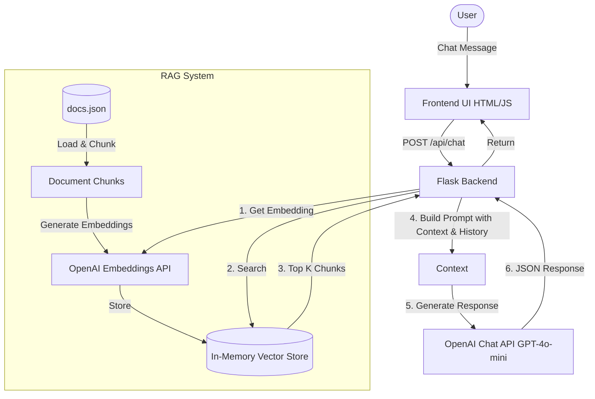

# GenAI Chat Assistant with RAG

A production-grade GenAI-powered chat assistant that uses Retrieval-Augmented Generation (RAG) to provide accurate, grounded answers based on a provided knowledge base.

## 🏗️ Architecture Diagram



## 🧠 RAG Workflow Explanation

1. **Initialization**: On backend startup, the system loads `docs.json`.
2. **Chunking**: Documents are split into logical text chunks.
3. **Pre-embedding**: Each chunk is passed to the OpenAI Embeddings API (`text-embedding-3-small`) to generate a vector representation, which is stored in memory (`numpy` array).
4. **Retrieval**: When a request comes in, the user's message is embedded. We perform a **Cosine Similarity** search against the document embeddings to find the closest matches.
5. **Generation**: The top 3 most relevant chunks (above a similarity threshold) are injected into the LLM system prompt as "context", ensuring the LLM's response is grounded in reality.

## 🔢 Embedding Strategy & Similarity Search

- **Model**: `text-embedding-3-small`. It is cost-effective, fast, and generates highly accurate 1536-dimensional vectors.
- **Chunking Strategy**: Given the short, focused nature of the knowledge base (`docs.json`), documents are maintained as single chunks prefixed with their titles to ensure semantic completeness. For larger documents, a recursive character splitter would be used.
- **Search Mechanism**: We use `numpy.dot()` for similarity. Since OpenAI embeddings are pre-normalized, the dot product is mathematically equivalent to Cosine Similarity.
- **Filtering**: We select the top `K=3` results and apply a similarity threshold of `0.25` to filter out irrelevant information. If nothing matches, a fallback response is triggered.

## 📝 Prompt Design Reasoning

The system prompt is designed to restrict LLM hallucination:
```
You are a helpful, accurate customer support assistant. 
You are required to answer the user's question primarily using the provided Knowledge Base Information.
If the Knowledge Base does not contain enough information to answer the user's question, clearly state "I don't have enough information to answer that based on our documentation." Do not hallucinate or guess.

[Retrieved Context Inserted Here]
```
- **Role play**: Setting the role as an accurate customer support assistant.
- **Strict Guidelines**: Explicit instructions to explicitly fail rather than guess if knowledge is missing.
- **Temperature Control**: Temperature is set to `0.2` to ensure deterministic, focused outputs.
- **Conversation State**: The last 5 message pairs are injected below the system prompt to maintain multi-turn chat capabilities without diluting the strict system instructions.

## 🚀 Setup Instructions

1. **Clone & Setup Environment**
   ```bash
   # Create a virtual environment and activate it
   python -m venv venv
   source venv/bin/activate  # On Windows: .\venv\Scripts\activate
   
   # Install dependencies
   pip install -r requirements.txt
   ```

2. **Configure Environment Variables**
   - Copy `.env.example` to a new file named `.env`.
   - Open `.env` and add your OpenAI API key:
     ```env
     OPENAI_API_KEY="sk-proj-your-api-key-here"
     ```

3. **Run the Application**
   ```bash
   python app.py
   ```
   The Flask backend will start on `http://127.0.0.1:5000`.

4. **Use the Assistant**
   - Open a browser and navigate to `http://127.0.0.1:5000`.
   - Ask a question related to the knowledge base (e.g., "How do I reset my password?").
   - Ask an unrelated question to test the RAG grounding fallback.
